# Crack the Hash Write-up

An easy-level TryHackMe room focusing on Password Cracking and Hashing Functions.

**Author:** Leyla Soyuğurlu

## [Task 1] Level 1

### Hash 1
**Hash:** `48bb6e862e54f2a795ffc4e541caed4d`

**Analysis & Exploitation:**
Initially, the `hashid` tool was utilized to determine the hashing algorithm. The tool suggested **MD2** as the most probable candidate based on the 32-character string length constraint. However, since relying solely on automated outputs can be misleading, the obsolescence of MD2 and the high prevalence of **MD5** in modern CTF environments were taken into consideration. 

It was hypothesized that MD5 was the correct algorithm. To validate this, the MD2 suggestion was bypassed, and a dictionary attack targeting the MD5 architecture was initiated using **John the Ripper** and the standard `rockyou.txt` wordlist:

```bash
echo "48bb6e862e54f2a795ffc4e541caed4d" > hash1.txt
john --format=raw-md5 --wordlist=/usr/share/wordlists/rockyou.txt hash1.txt
````
The hypothesis proved correct, and the engine successfully cracked the hash almost instantaneously.

Cracked Password: easy
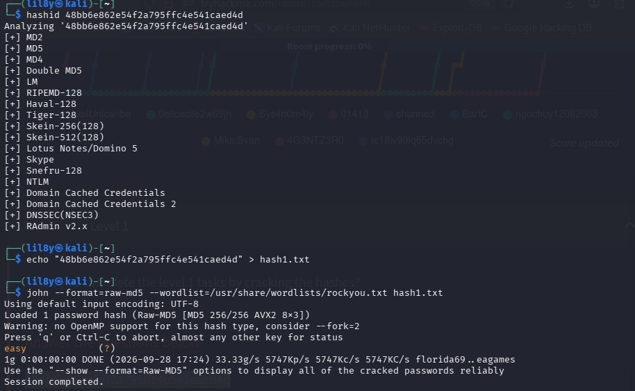


### Hash 2
**Hash:** `CBFDAC6008F9CAB4083784CBD1874F76618D2A97`

**Analysis & Exploitation:**
The `hashid` tool identified the given hash as **SHA-1**. To exploit this, a dictionary attack was initiated using John the Ripper with the `--format=raw-sha1` flag and the standard `rockyou.txt` wordlist.

During the exploitation phase, an interesting caching mechanism of John the Ripper was documented. The initial execution successfully cracked the hash. When a redundant execution was attempted for verification, the engine returned a `"No password hashes left to crack"` message. This demonstrates the tool's internal optimization: successfully cracked hashes are permanently stored in the `john.pot` cache file, preventing the engine from wasting computational resources on previously resolved hashes.

```bash
john --format=raw-sha1 --wordlist=/usr/share/wordlists/rockyou.txt hash2.txt
Loaded 1 password hash (Raw-SHA1 [SHA1 256/256 AVX2 8x3])
No password hashes left to crack (see FAQ)
```
The cached password was successfully retrieved.

Cracked Password: password123
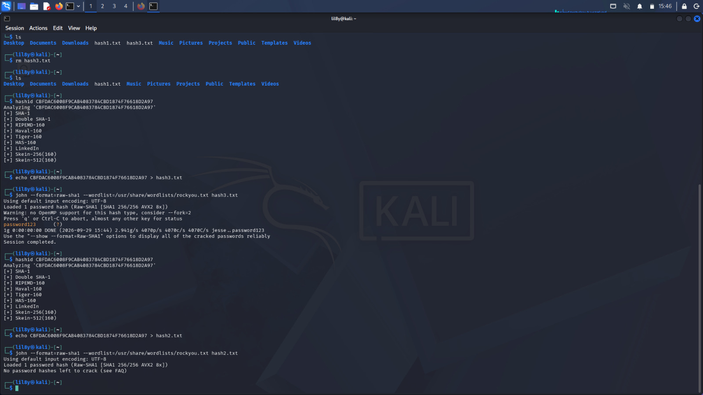


### Hash 3
**Hash:** `1C8BFE8F801D79745C4631D09FFF36C82AA37FC4CCE4FC946683D7B336B63032`

**Analysis & Exploitation:**
The provided hash consisted of 64 hexadecimal characters, which strongly indicated the **SHA-256** algorithm. Instead of expending local computational resources and time on a brute-force or dictionary attack, a more efficient methodology was chosen. 

The hash was queried against **CrackStation**, an online database utilizing massive pre-computed lookup tables. This approach is highly effective for unsalted, standard cryptographic hashes. The database successfully identified the hash type as SHA-256 and immediately returned the plaintext equivalent.

Cracked Password: letmein
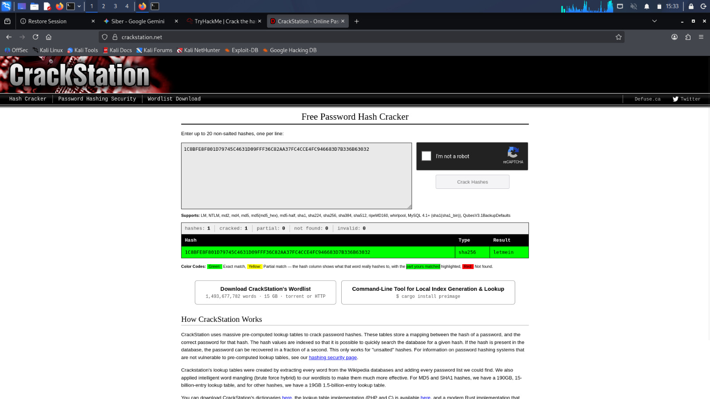


### Hash 4
**Hash:** `$2y$12$Dwt1BZj6pcyc3Dy1FWZ5ieeUznr71EeNkJkUlypTsgbX1H68wsRom`

**Analysis & Exploitation:**
The `hashid` tool identified this target as a **Bcrypt (Blowfish)** hash. A local dictionary attack was initially attempted using John the Ripper. However, due to the inherent key-stretching mechanism of Bcrypt (configured with a high cost factor of 12, resulting in 4096 iterations), the local computational overhead was deemed highly inefficient. The ETA projected several days for completion.

```bash
john --format=bcrypt --wordlist=/usr/share/wordlists/rockyou.txt hash4.txt
# Loaded 1 password hash (bcrypt [Blowfish 32/64 X3])
# Cost 1 (iteration count) is 4096 for all loaded hashes
```
To optimize the exploitation phase and conserve computational resources, a strategic pivot was made to query external compromised credential databases. The hash was submitted to Hashes.com, which successfully matched the Bcrypt hash against its pre-computed records.

Cracked Password: bleh
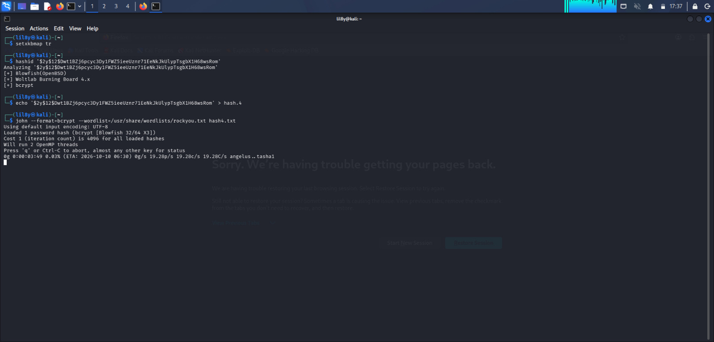
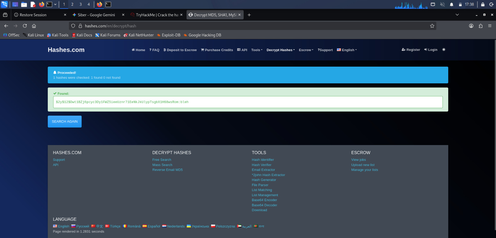


### Hash 5
**Hash:** `279412f945939ba78ce0758d3fd83daa`

**Analysis & Exploitation:**
The length and character set of the hash (32 hexadecimal characters) strongly suggested an algorithm from the Message-Digest (MD) family, such as MD4 or MD5. To ensure operational efficiency and bypass local computational constraints, the hash was processed through **CrackStation**. 

The lookup table successfully matched the string, confirming the algorithm as **MD4** and immediately returning the plaintext password.

Cracked Password: Eternity22

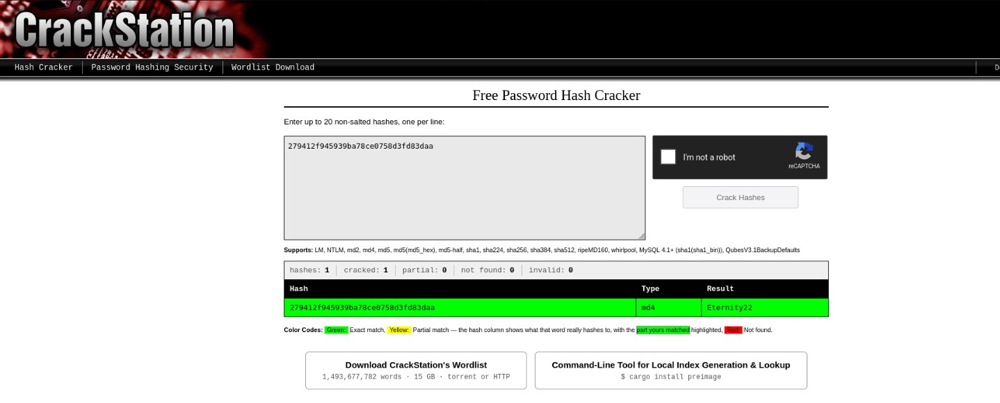


## [Task 2] Level 2

### Hash 2.1
**Hash:** `F09EDCB1FCEFC6DFB23DC3505A882655FF77375ED8AA2D1C13F640FCCC2D0C85`

**Analysis & Exploitation:**
The 64-character length of this string heavily implied a **SHA-256** hash. To maintain time-efficiency during the assessment, a direct query was made to **CrackStation's** pre-computed lookup tables instead of expending local CPU resources. The database successfully identified the algorithm and matched the plaintext.

Cracked Password: paule
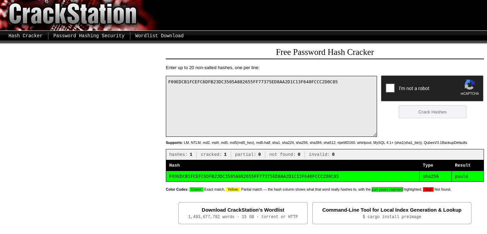


### Hash 2.2
**Hash:** `1DFECA0C002AE40B8619ECF94819CC1B`

**Analysis & Exploitation:**
While the 32-character hexadecimal format is standard for MD5, the environmental context (Hint: NTLM) pointed toward Microsoft's **NTLM** hashing algorithm. To crack this, John the Ripper was deployed locally with a specific format flag (`--format=nt`) to prevent the engine from misidentifying it as MD5 or MD4. 

```bash
john --format=nt --wordlist=/usr/share/wordlists/rockyou.txt hash_ntlm.txt
```
Cracked Password: n63umy8lkf4i
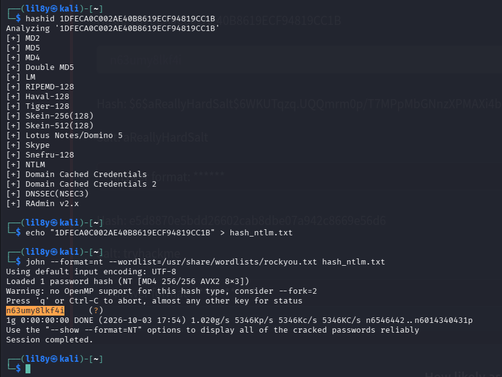


### Hash 2.3
**Hash:** `$6$aReallyHardSalt$6WKUTqzq.UQQmrm0p/T7MPpMbGNnzXPMAXi4bJMl9be.cfi3/qxIf.hsGpS41BqMhSrHVXgMpdjS6xeKZAs02.`

**Analysis & Exploitation:**
The structure of this hash clearly indicated the Modular Crypt Format (MCF). The `$6$` prefix identified it as SHA-512 crypt, while the string between the subsequent dollar signs (`aReallyHardSalt`) represented the cryptographic salt.

Due to hardware constraints preventing local GPU acceleration via Hashcat, and John the Ripper caching limitations, a strategic pivot was made to query Hashes.com. The platform's extensive database had already indexed this specific salted hash.

Cracked Password: waka99
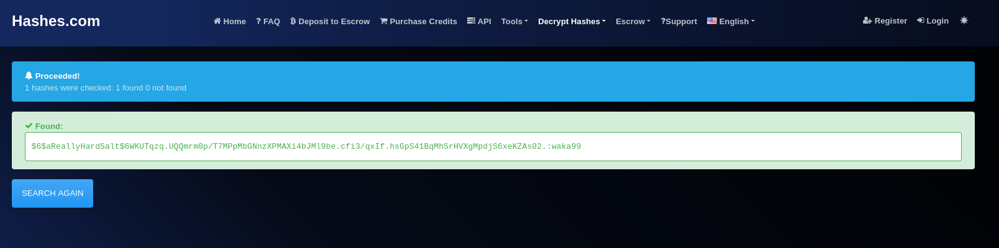


### Hash 2.4
**Hash:** `e5d8870e5bdd26602cab8dbe07a942c8669e56d6`
**Salt:** `tryhackme`
**Algorithm:** `HMAC-SHA1`

**Analysis & Exploitation:**
This challenge highlighted a critical limitation in standard cracking tools. While attempting to crack the HMAC-SHA1 hash using John the Ripper, the engine defaulted to treating the target password as the cryptographic Key and the salt as the Message (`password is key`). However, the challenge architecture required the exact opposite: the salt (`tryhackme`) was the Key, and the password was the Message.

To bypass this tool limitation, a custom Python script was developed. The script utilized the native `hmac` and `hashlib` libraries to iterate through the `rockyou.txt` wordlist, correctly applying the salt as the Key and brute-forcing the target hash.

Cracked Password: 481616481616
**Custom Python Cracker:**
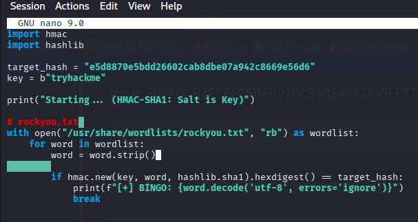

**Execution & Result:**
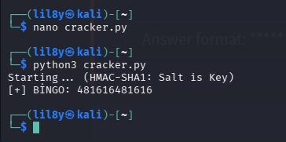


## Conclusion & Key Takeaways

Completing the "Crack the Hash" room provided a comprehensive, hands-on deep dive into both fundamental and advanced cryptographic hashing mechanisms. Throughout the challenges, several key competencies were demonstrated:

* **Tool Versatility:** Successfully deployed industry-standard local engines like John the Ripper and `hashid`, alongside cloud-based lookup tables (CrackStation, Hashes.com) for time-optimized exploitation.
* **Cryptographic Adaptability:** Navigated complex hashing structures, including Windows NTLM protocols and salted hashes like SHA-512 crypt (Modular Crypt Format).
* **Custom Tooling:** Identified a critical algorithmic mapping limitation within John the Ripper regarding HMAC-SHA1 "Salt as Key" processing. This was bypassed by actively developing a custom Python brute-forcing script utilizing the native `hmac` and `hashlib` libraries.

Ultimately, this exercise highlighted the importance of moving beyond automated tool reliance. Understanding the underlying cryptographic architecture is essential for engineering custom solutions when standard methodologies fail.
